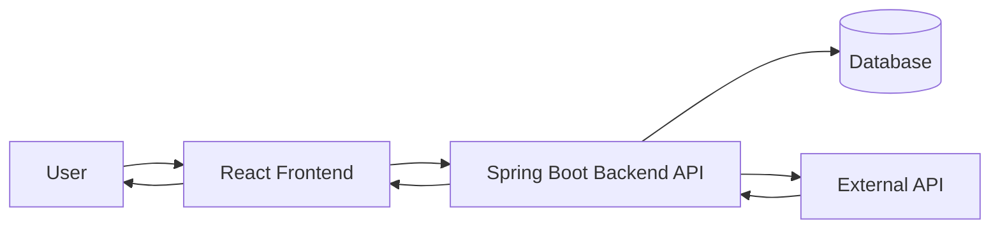

## 3. System Decomposition

### System Modules
The application will be divided into the following major modules:

1. **Authentication Module**
   - Handles user registration, login, and secure session management  
   - Ensures user data privacy and account security  

2. **Task Management Module**
   - Allows users to create, edit, and delete tasks  
   - Supports task prioritization, categorization, and due dates  

3. **Dashboard Module**
   - Displays all tasks in an organized view  
   - Shows upcoming deadlines and task summaries  

4. **Notification Module**
   - Provides reminders for upcoming tasks and deadlines  
   - Integrates with external API to trigger time-based alerts  

5. **External API Integration Module**
   - Connects to Google Calendar API (or similar)  
   - Syncs tasks with real-world dates  
   - Optionally imports external calendar events  

---

### Data Flow Diagram (Level-0)
The following diagram shows how data moves through the system:

